# RenderdocBrownbag

A simple Vulkan application setup for demonstrating RenderDoc usage with multiple examples.

## Prerequisites

- CMake 3.16 or higher
- C++ compiler with C++17 support
- Vulkan SDK installed
- RenderDoc installed (for debugging)

## Building the Project

1. Clone the repository:

   ```bash
   git clone https://github.com/yourusername/RenderdocBrownbag.git
   cd RenderdocBrownbag
   ```

2. Create a build directory and navigate to it:

   ```bash
   mkdir build
   cd build
   ```

3. Configure the project with CMake:

   ```bash
   # Build all examples (default)
   cmake ..

   # Or build only a specific example
   cmake .. -DBUILD_ALL_EXAMPLES=OFF -DEXAMPLE=0_HelloTriangle

   # Or build only the Vertex Buffer example
   cmake .. -DBUILD_ALL_EXAMPLES=OFF -DEXAMPLE=1_VertexBuffer

   # Or build only the Texture Mapping example
   cmake .. -DBUILD_ALL_EXAMPLES=OFF -DEXAMPLE=2_TextureMapping

   # Or build only the Compute example
   cmake .. -DBUILD_ALL_EXAMPLES=OFF -DEXAMPLE=3_Compute

   # Or build only the Compute Skinning example
   cmake .. -DBUILD_ALL_EXAMPLES=OFF -DEXAMPLE=4_ComputeSkinning
   ```

4. Build the project:

   ```bash
   cmake --build .
   ```

## Running the Examples

After building, you can run any of the examples in the build directory:

```pwsh
# Run the Hello Triangle example
.\bin\Debug\0_HelloTriangle.exe

# Run the Vertex Buffer example
.\bin\Debug\1_VertexBuffer.exe

# Run the Texture Mapping example
.\bin\Debug\2_TextureMapping.exe

# Run the Compute example
.\bin\Debug\3_Compute.exe

# Run the Compute Skinning example
.\bin\Debug\4_ComputeSkinning.exe
```

## Using with RenderDoc

1. Launch RenderDoc
2. File -> Launch Application
3. Select the example executable (e.g., `0_HelloTriangle`, `1_VertexBuffer`, `2_TextureMapping`, `3_Compute`, or `4_ComputeSkinning`)
4. Click Launch
5. Capture a frame by pressing F12 or using the RenderDoc UI
6. Analyze the captured frame in RenderDoc

The example runner compiles shaders on the fly using `glslc -g -O0`, so the
SPIR-V binaries contain debug information. When you open a capture in RenderDoc
you'll be able to see and step through the original GLSL source.

## Project Structure

- `common/` - Common code shared between examples
  - `vulkan_app.h` - Vulkan application header
  - `vulkan_app.cpp` - Vulkan application implementation
- `examples/` - Example applications
  - `0_HelloTriangle/` - Basic triangle rendering using hardcoded vertices
    - `main.cpp` - Entry point
    - `shaders/` - GLSL shader files
  - `1_VertexBuffer/` - Triangle rendering using vertex buffers
    - `main.cpp` - Entry point
    - `shaders/` - GLSL shader files
  - `2_TextureMapping/` - Textured quad rendering using vertex and index buffers
    - `main.cpp` - Entry point
    - `shaders/` - GLSL shader files
  - `3_Compute/` - Minimal compute shader example
    - `main.cpp` - Entry point
    - `shaders/` - GLSL compute shader
  - `4_ComputeSkinning/` - Compute skinning using a texture-mapped quad
    - `main.cpp` - Entry point
    - `shaders/` - Vertex, fragment, and compute shaders
  - `CMakeLists.txt` - CMake build configuration

## Examples

### 0_HelloTriangle

This example demonstrates the most basic Vulkan rendering setup:

- Basic Vulkan initialization
- Window creation with GLFW
- Swap chain setup
- Graphics pipeline configuration
- Simple triangle rendering with hardcoded vertices in the shader

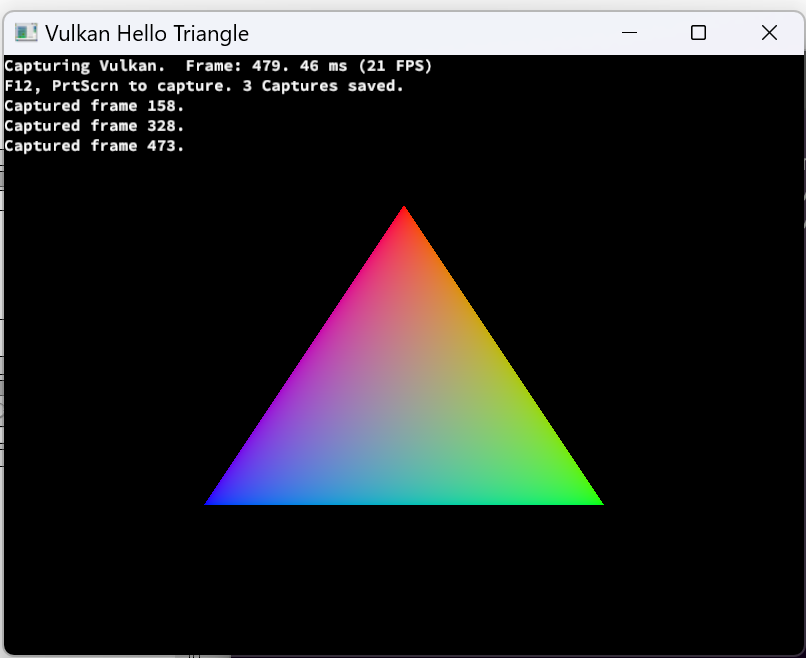

#### Event Viewer

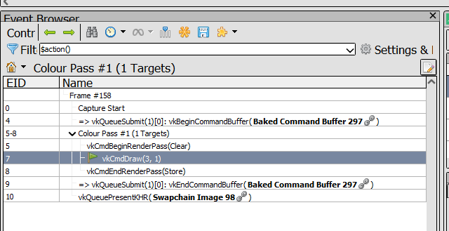

These show the calls you've made: just a single draw call

Selecting an event (like vkCmdDraw) lets you see what happened during that call.

#### Mesh Viewer

The mesh viewer shows you inputs and outputs of the vertex shader.

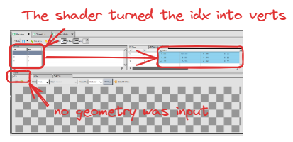

You can see here that there is no input mesh. that's becuase the triangle is drawn entirely by the shader.

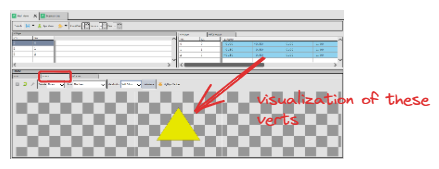

#### Debugging Verts

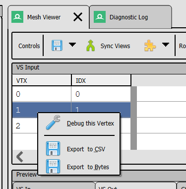

you can debug the vertex shader for a given vertex by right clicking and choosing debug.

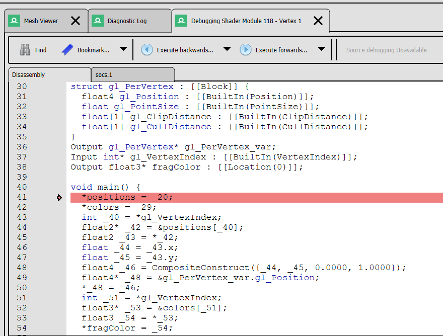

By default you'll have the disassembly window open.


These examples also provide debug information so you can view the source of the shader.

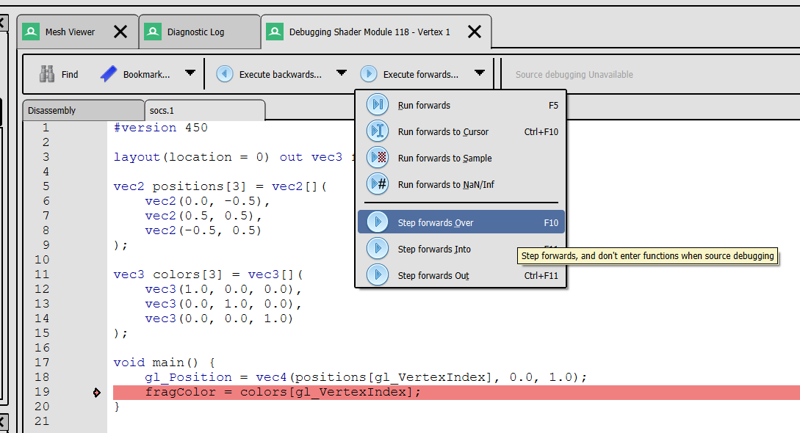

#### Texture Viewer

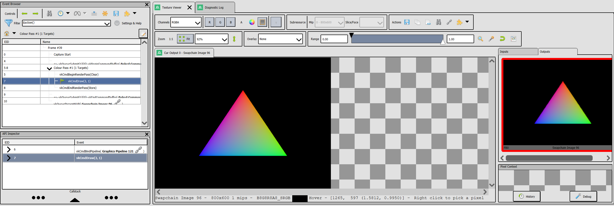

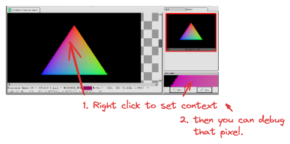

#### Debugging a pixel (fragment)

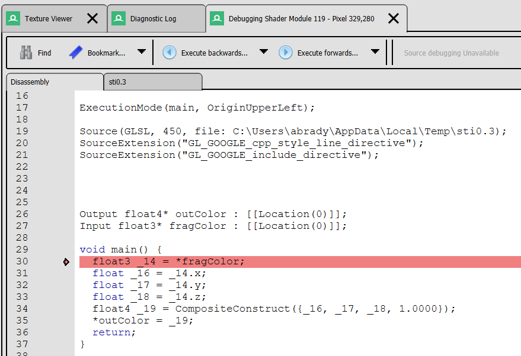

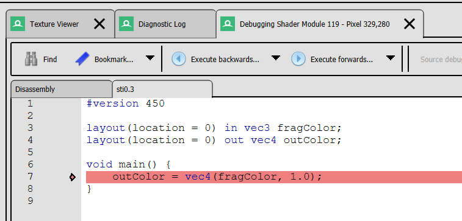

Similar controls to the above vertex debugger.

#### Debugging Fragments

And you can debug things pretty much like most debuggers.

#### Challenges

1. Debug into the vertex and fragment shaders and examine the variables.

### 1_VertexBuffer

This example builds on the Hello Triangle example and adds:

- Vertex buffer creation and usage
- Vertex input binding and attribute descriptions
- Passing vertex data from C++ to the shader

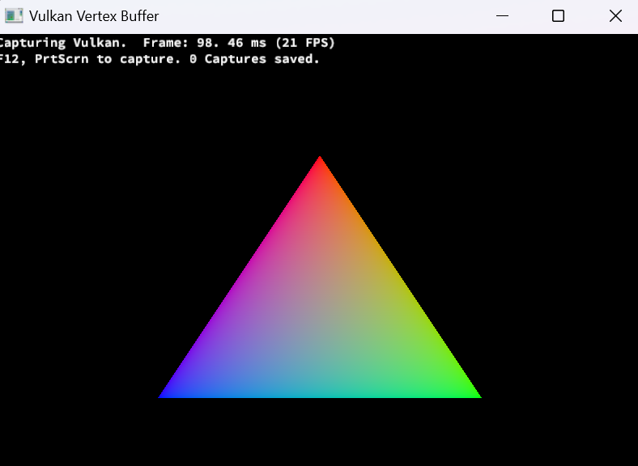

Visually it looks the same as 0_HelloTriangle. The difference is that this time the verts come from the CPU:

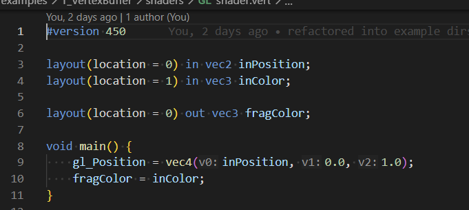

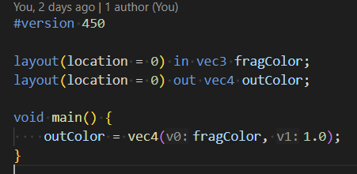

The vertex shader just passes through the position and color, and the fragment shader just uses the given color.

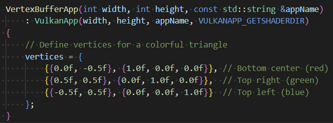

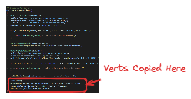

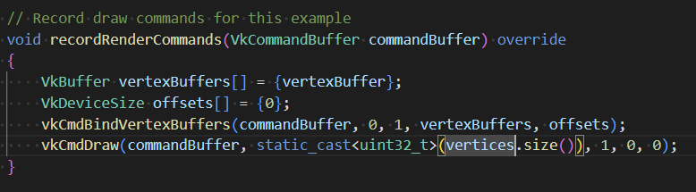

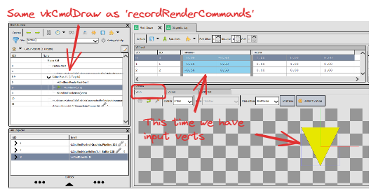

Debugging this is basically identical to 0_HelloTriangle except for how the shader handles the input.

#### Pipeline State

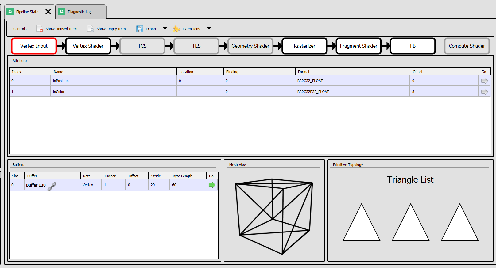

Now that we have some input, it is worth looking at the Pipeline State Panel. This panel is the top-level view of what's being rendered this call.

You can click on each of the pipeline stages to see more info. There's not much to see beyond the Vertex Input so we'll cover the other stages
in more detail later.

##### Vertex Input and Buffer Contents

As shown above, the first stage in the pipeline

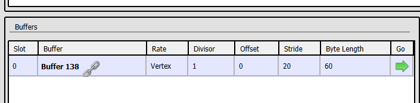

If you click this green arrow you can view the input contents:

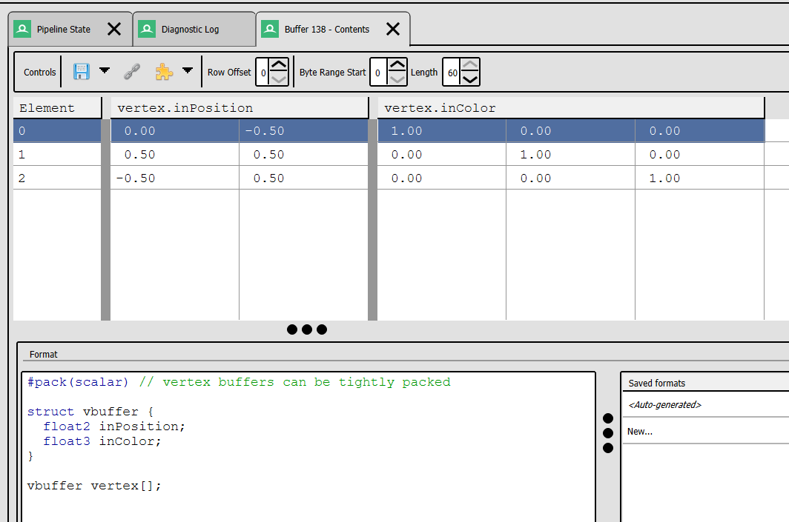

##### Rasterizer

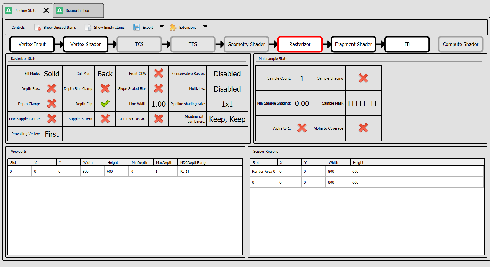

Various fixed-function and state info that may be useful in some situations.

##### Frame Buffer

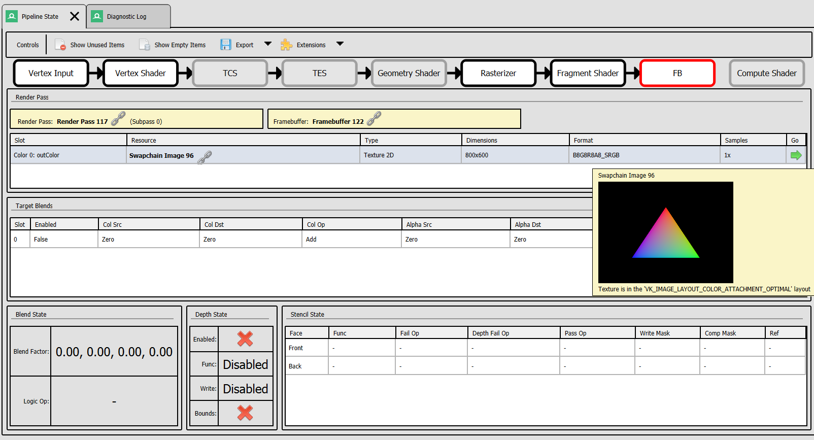

The only interesting thing here is that you can see what the final image looks like if you choose.

#### Challenges

1. Change the code to draw a second triangle, then follow it being drawn in renderdoc

### 2_TextureMapping

This example builds on the previous examples and demonstrates:

- Texture loading and uploading to the GPU
- Creating image views and samplers
- Using descriptor sets to bind textures to shaders
- UV coordinates in vertex data
- Sampling textures in fragment shaders
- Index buffer usage for efficient rendering
- Procedural texture generation

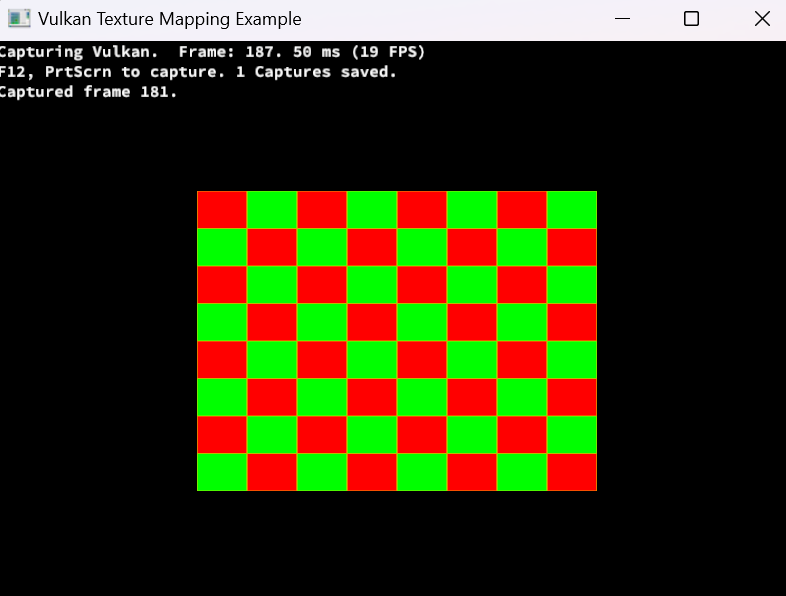

This is the first example with enough complexity to dive into a few different things:

#### Vertex Input

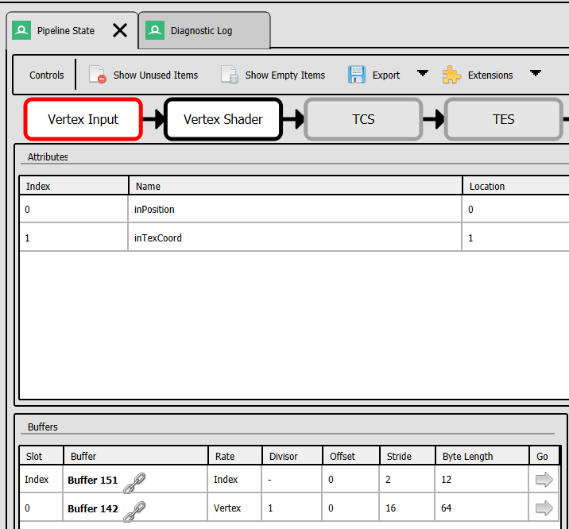

- a vertex and index buffer
- the input vertex now contains a UV texture coord

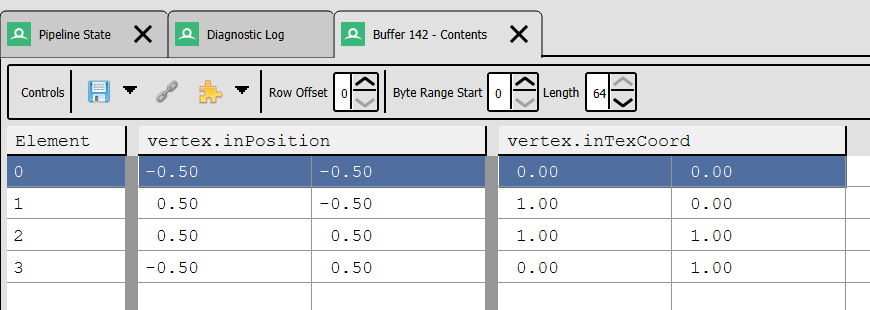

#### Mesh Viewer


The mesh viewer will highlight the triangle that is being drawn as part of what you've selected now that we have more than one triangle

#### Fragment Shader


The fragment shader now has a texture bound to it

#### TextureMapping Challenges

1. Step through this in the debugger and make sure you understand what is bound to the vertex and fragment shaders and how sampling works.
2. Add color back to each vertex

### 3_Compute

This example demonstrates a minimal compute pipeline:

- Creates a storage buffer filled with numbers
- Dispatches a compute shader that doubles each value
- Reads back and prints the results to the console

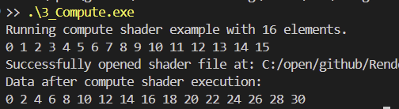

Nothing visual about this one: it just doubles each value of the inputs.

One thing worth showing in this example is the in-app renderdoc api: the nutshell is that
if you launch an app with renderdoc, the renderdoc.dll will be injected and you can query it with
`GetModuleHandleA("renderdoc.dll");`

#### Enabling RenderDoc Capture in the Compute Example

The `3_Compute` example contains optional code that programmatically triggers a
RenderDoc capture around the compute dispatch. To enable this feature during the
build, configure CMake with the following options:

```bash
cmake .. -DENABLE_RENDERDOC_CAPTURE=ON -DRENDERDOC_INCLUDE_DIR=/path/to/renderdoc/include
```

`RENDERDOC_INCLUDE_DIR` should point to the directory containing
`renderdoc_app.h` (for example `C:/Program Files/RenderDoc/include` on Windows or
`/usr/include` on Linux). When enabled, running the compute example will produce
a capture without requiring manual interaction in the RenderDoc UI.

#### Debugging Compute Shaders

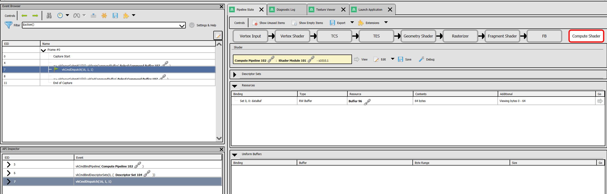

The compute stage can be found in the Pipeline State panel on the far right. You can choose to debug from this view

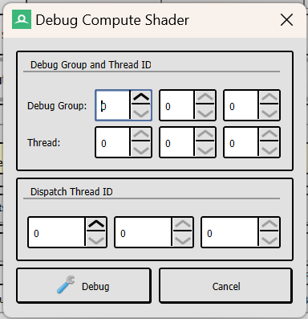

### 4_ComputeSkinning

This example shows how compute shaders can be used for vertex skinning:

- Uses a compute shader to transform quad vertices with two bone matrices
- Copies the skinned results into a vertex buffer
- Renders the textured quad using the skinned positions

## Debugging with RenderDoc

RenderDoc is a powerful graphics debugging tool that allows you to:

- Capture frames from Vulkan applications
- Inspect draw calls, resources, and pipeline state
- View and edit shaders
- Analyze performance

When using RenderDoc with these examples, you can:

1. Inspect the vertex data
2. View the shader code
3. See the pipeline state
4. Analyze the rendered output
5. Examine texture data and sampling
6. Debug UV mapping issues

This is particularly useful for understanding how Vulkan works and for debugging rendering issues.
